# 🎉 feature_recognition 🎉

<br>

[]()
[](./README_CN.md)
[](./README.md)
[]()
[]()
[]()
[]()
[](https://pypi.python.org/pypi/face_recognition)
[](https://github.com/aiparkhub)
[](https://github.com/aiparkhub)
[](https://github.com/jeep711)

<br>

<div align="center" style="width:1920px;height:500px">
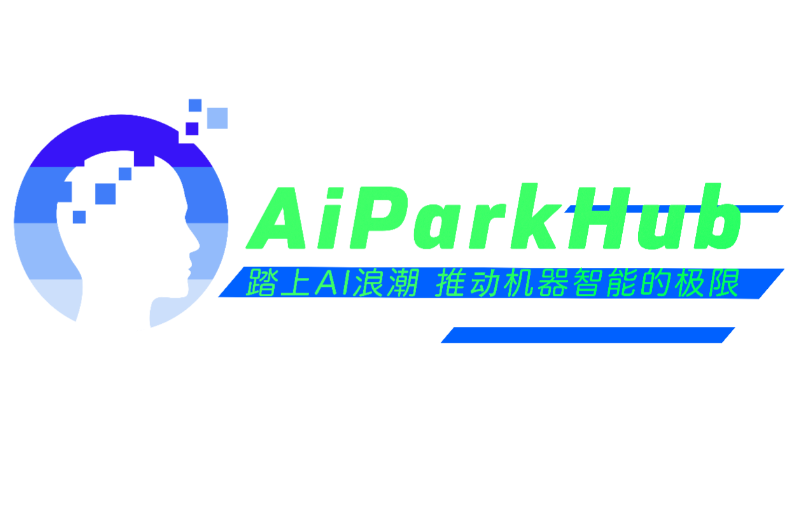
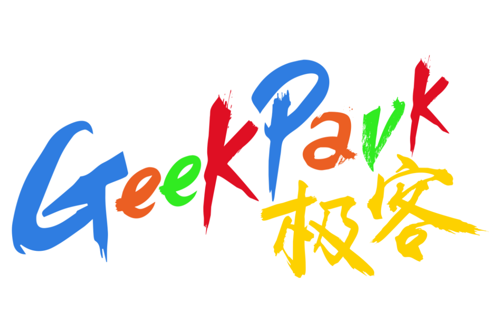
</div><br>

- **AIParkHub-Organization | Embarking on the AI ​​wave, pushing the limits of machine intelligence**
- **`Official Public Email`**
- Organization Email：<aiparkhub@outlook.com> —— <geekparkhub@outlook.com> —— <hackerparkhub@outlook.com>
- Developer Email：<jeep711.home.@gmail.com> —— <jeep-711@outlook.com>
- System Email：<systemhub-711@outlook.com>
- Service Email：<servicehub-711@outlook.com>

## 1. Foreword
#### Tribute to contributors in all areas of technology
> The [feature_recognition](https://github.com/aiparkhub/feature_recognition) you are reading is `AIParkHub-Organization`, a powerful open source project for face recognition based on the Python programming language, Easy-to-use, concise face recognition library equipped with application cases, providing you with Python command line tools to extract, recognize, and operate portrait faces;

> Face recognition is based on the deep learning model in the industry-leading C ++ open source library [dlib](http://dlib.net/), which collects [Labeled Faces in the Wild](http://vis-www.cs.umass.edu/lfw/) datasets for testing.The accuracy rate is as high as `99.38%`, but the accuracy rate of children and Asian portrait faces remains to be determined Promotion;

> [Labeled Faces in the Wild](http://vis-www.cs.umass.edu/lfw/) University of Massachusetts Amherst (University of Massachusetts Amherst)Produced portrait face dataset, this dataset contains more than `13,000` face images collected from the network;

## 2. Project Tree Structure
```
.
├── LICENSE
├── README.md
├── README_CN.md
├── aiparkhub
│   ├── __init__.py
│   └── core
│       ├── __init__.py
│       ├── data
│       │   └── feature_training_dataset
│       │       ├── part_0
│       │       │   └── face_recognition_models
│       │       │       ├── dlib_face_recognition_resnet_model_v1.dat
│       │       │       ├── mmod_human_face_detector.dat
│       │       │       ├── shape_predictor_5_face_landmarks.dat
│       │       │       └── shape_predictor_68_face_landmarks.dat
│       │       ├── part_1
│       │       │   ├── momoland
│       │       │   │   ├── dataset_for_photo
│       │       │   │   ├── dataset_for_video
│       │       │   │   └── rendering_data
│       │       │   ├── president_obama
│       │       │   │   ├── dataset_for_photo
│       │       │   │   ├── dataset_for_video
│       │       │   │   └── rendering_data
│       │       │   └── short_video
│       │       ├── part_2
│       │       │   ├── AJ_Cook
│       │       │   ├── ......
│       └── models
│           ├── __init__.py
│           ├── faces_keypoint_recognition
│           │   ├── __init__.py
│           │   ├── digital_makeup.py
│           │   └── find_facial_features_in_picture.py
│           ├── faces_positioning
│           │   ├── __init__.py
│           │   ├── blur_faces_on_webcam.py
│           │   ├── find_faces_in_batches.py
│           │   ├── find_faces_in_picture.py
│           │   └── find_faces_in_picture_cnn.py
│           ├── faces_recognition
│           │   ├── __init__.py
│           │   ├── face_distance.py
│           │   ├── face_recognition_knn.py
│           │   ├── facerec_from_video_file.py
│           │   ├── feature_recognition.py
│           │   ├── feature_recognition_multiprocessing.py
│           │   └── identify_and_draw_boxes_on_faces.py
│           └── training_feature
│               ├── __init__.py
│               └── training_portrait_feature_models.py
├── docs
├── face_recognition
│   ├── __init__.py
│   ├── api.py
│   ├── face_detection_cli.py
│   └── face_recognition_cli.py
├── requirements.txt
├── requirements_dev.txt
├── resource
├── tox.ini
└── trained_knn_model.clf

124 directories, 249 files
```

## 3. How to use
### 3.1 Clone Engineering
``` bash
git clone https://github.com/aiparkhub/feature_recognition.git
```

### 3.2 (Mac or Linux) Install Python dependencies
> 3.20 ⚠️ Check Python version in advance-Python version should be> = 3.x.x

> Environment configuration

- Python 3.3+ or Python 2.7
- macOS or Linux 
- Windows Not officially supported, but may work
``` bash
(base) systemhub:~ system$ python --version
Python 3.7.5
(base) systemhub:~ system$ 
```

> 3.2.1 ⚠️ Check pip version in advance
``` bash
(base) systemhub:~ system$ pip --version
pip 20.0.2 from /XXX/XXX/Python.framework/Versions/3.7/lib/python3.7/site-packages/pip (python 3.7)
(base) systemhub:~ system$ pip3 --version
pip 20.0.2 from /XXX/XXX/Python.framework/Versions/3.7/lib/python3.7/site-packages/pip (python 3.7)
(base) systemhub:~ system$ 
```
> 
> 3.2.2 ⚠️ If pip version is too low. Pip version should be upgraded (non-low version skip this step, proceed to the next step)
>
> If pip is the overseas mirror source by default and the network connection is poor, you can temporarily make the domestic mirror station upgrade pip, and then set pip as the domestic mirror source by default after the upgrade.
```
pip install -i https://pypi.tuna.tsinghua.edu.cn/simple pip -U
```
> 
> Set pip as the domestic mirror source by default
```
pip config set global.index-url https://pypi.tuna.tsinghua.edu.cn/simple
```

> 3.2.3 Based on production version | If there are multiple versions of pip, please use pip3 to operate
``` bash
pip3 install -r requirements.txt
```
> 
> 3.2.4 Based on development version | If there are multiple versions of pip, please use pip3 to operate
``` bash
pip3 install -r requirements_dev.txt
```


## 4. Feature Engineering Example

### 4.1 Based on (Engineering Example)
> If your machine is a multi-core CPU, you can accelerate face recognition through parallel operations. For example, if your machine has four cores, you can increase the operation speed by about four times;
>
> If you use Python 3.4 or later, you can pass in `--cpus <number_of_cpu_cores_to_use>` Parameters or passed in `--cpus -1` Parameters to call all cores of the CPU;
``` bash
$ python example.py --cpus 4
$ python example.py --cpus -1
```

#### 4.1.1 Keypoint recognition for portrait faces
- [Example: Draw beauty for portrait faces](aiparkhub/core/models/faces_keypoint_recognition/digital_makeup.py)
> 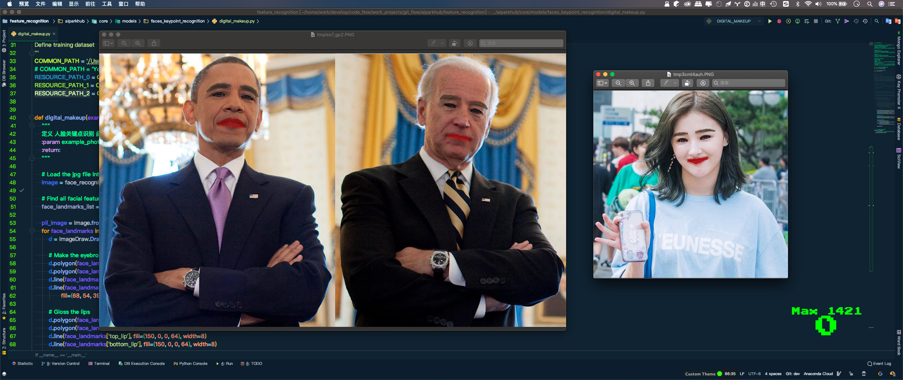
``` bash
$ python aiparkhub/core/models/faces_keypoint_recognition/digital_makeup.py --cpus 4
```

- [Example: Extract key points from portrait faces](aiparkhub/core/models/faces_keypoint_recognition/find_facial_features_in_picture.py)
> 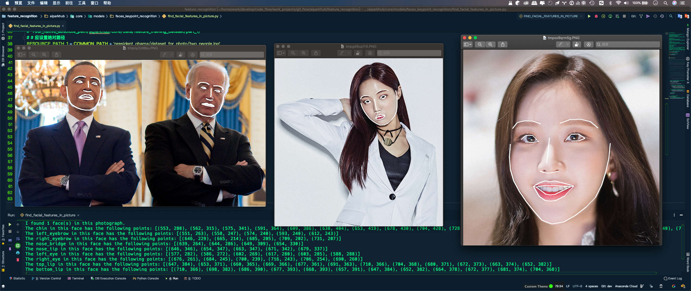
``` bash
$ python aiparkhub/core/models/faces_keypoint_recognition/find_facial_features_in_picture.py --cpus 4
```


#### 4.1.2 Portrait Facial Positioning
- [Example: Locate portrait faces](aiparkhub/core/models/faces_positioning/find_faces_in_picture.py)
> 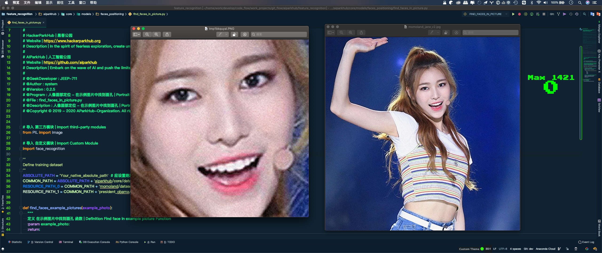
``` bash
$ python aiparkhub/core/models/faces_positioning/find_faces_in_picture.py --cpus 4
```

- [Example: Deep learning model based on convolutional neural network](aiparkhub/core/models/faces_positioning/find_faces_in_picture_cnn.py)
> 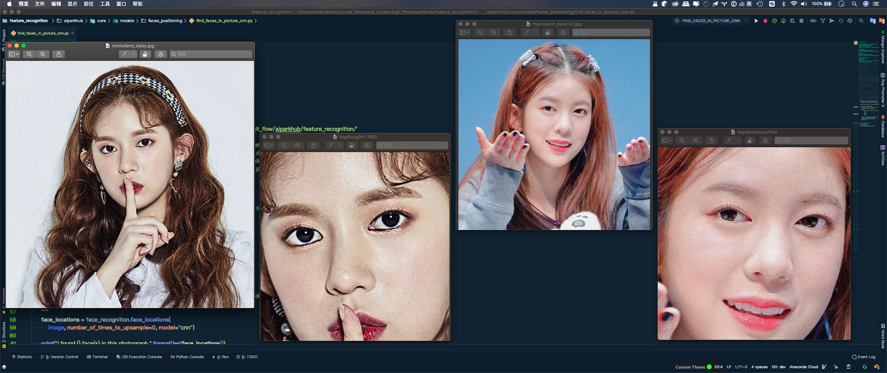
``` bash
$ python aiparkhub/core/models/faces_positioning/find_faces_in_picture_cnn.py --cpus 4
```

- [Example: Deep learning model based on convolutional neural network Batch recognition of portrait faces in resources](aiparkhub/core/models/faces_positioning/find_faces_in_batches.py)
> 
``` bash
$ python aiparkhub/core/models/faces_positioning/find_faces_in_batches.py --cpus 4
```

- [Example: Webcam-based video Gaussian blur on face (requires OpenCV)](aiparkhub/core/models/faces_positioning/blur_faces_on_webcam.py)
> 
``` bash
$ python aiparkhub/core/models/faces_positioning/blur_faces_on_webcam.py --cpus -1
```


#### 4.1.3 Face Recognition
- [Example: After face recognition, draw a label box and name on the original image](aiparkhub/core/models/faces_recognition/identify_and_draw_boxes_on_faces.py)
> 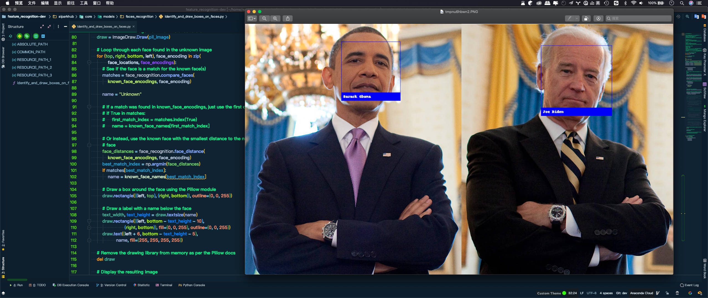
``` bash
$ python aiparkhub/core/models/faces_recognition/identify_and_draw_boxes_on_faces.py --cpus 4
```

- [Example: Compare whether two faces belong to one person with different accuracy](aiparkhub/core/models/faces_recognition/face_distance.py)
> 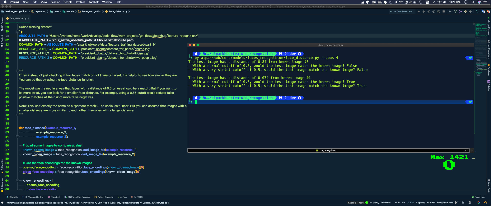
``` bash
$ python aiparkhub/core/models/faces_recognition/face_distance.py --cpus 4
```

- [Example: Face Recognition - Fast Training Model & Slow Training Model (requires OpenCV)](aiparkhub/core/models/faces_recognition/feature_recognition.py)
> 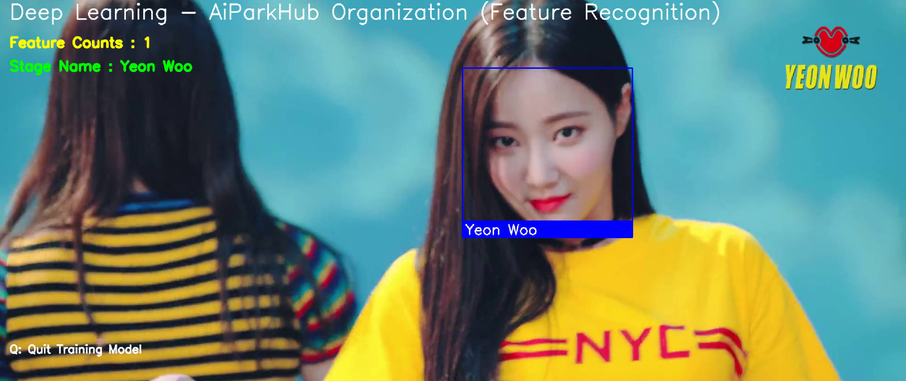
``` bash
$ python aiparkhub/core/models/faces_recognition/feature_recognition.py --cpus -1
```

- [Example: Count and count facial features](aiparkhub/core/models/training_feature/training_portrait_feature_models.py)
> 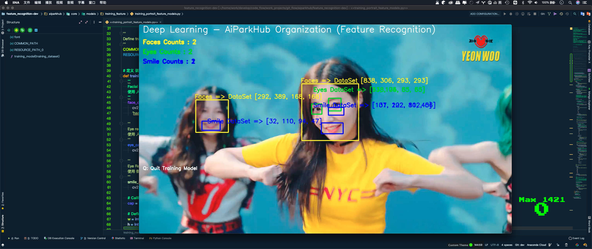
``` bash
$ python aiparkhub/core/models/training_feature/training_portrait_feature_models.py --cpus -1
```

- [Example: Face recognition based on K nearest neighbor KNN classification algorithm](aiparkhub/core/models/faces_recognition/face_recognition_knn.py)
> 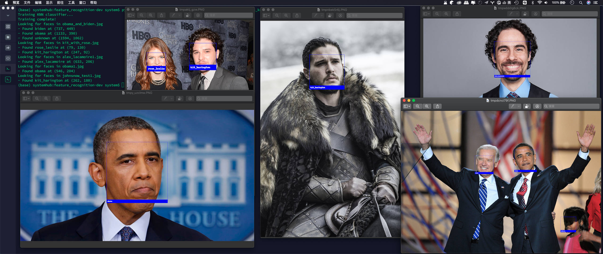
``` bash
$ python aiparkhub/core/models/faces_recognition/face_recognition_knn.py --cpus 4
```

- [Example: Speed ​​up face recognition operations](aiparkhub/core/models/faces_recognition/feature_recognition_multiprocessing.py)
> 
``` bash
$ python aiparkhub/core/models/faces_recognition/feature_recognition_multiprocessing.py --cpus -1
```


#### 4.1.4 Recommend Similar Content
- [Face recognition with OpenCV, Python, and deep learning](https://www.pyimagesearch.com/2018/06/18/face-recognition-with-opencv-python-and-deep-learning/) by Adrian Rosebrock
  - Main content: How to use it in practice;
- [Face clustering with Python](https://www.pyimagesearch.com/2018/07/09/face-clustering-with-python/) by Adrian Rosebrock
  - Main content: Use unsupervised learning algorithms to blur Gaussian faces in pictures;


#### 4.1.5 Face Recognition Principle
If you want to learn more about the black box principle of face recognition [Please click to read the technical blog](https://medium.com/@ageitgey/machine-learning-is-fun-part-4-modern-face-recognition-with-deep-learning-c3cffc121d78)


## 5. Warning instructions
- This open source project is a recognition model trained on the face of an adult. If the recognition model is applied to children, the effect may be average. If there are multiple children in the resource, it is recommended to set the threshold to 0.6;


## 6. Related Question Feedback
> If something goes wrong, please `Github`-[aiparkhub/feature_recognition](https://github.com/aiparkhub/feature_recognition/issues) Repository for submission Issue;


## 7. Thanks
- thank you very much [Davis King](https://github.com/davisking) ([@nulhom](https://twitter.com/nulhom)) Created the `dlib` library, which provides responsive face keypoint detection and face encoding related models, you can view [blog post](http://blog.dlib.net/2017/02/high-quality-face-recognition-with-deep.html) Website for more information on Res Net;
- Thanks for every relevant Python module(include: `numpy`, `scipy`, `scikit-image`, `pillow`)Contributor;
- thank [Cookiecutter](https://github.com/audreyr/cookiecutter) 和 [audreyr/cookiecutter-pypackage](https://github.com/audreyr/cookiecutter-pypackage) Project templates, making Python's packaging more accessible;


## 8. Postscript
> This project is only the starting point for the field of computer vision. The project will continue to be developed. There are still many technical dreams to be realized in the future, so that each version iteration becomes a rivet on the milestone;

## 9. License open source agreement
 [Apache License Version 2.0](./LICENSE)
 
 ---------
