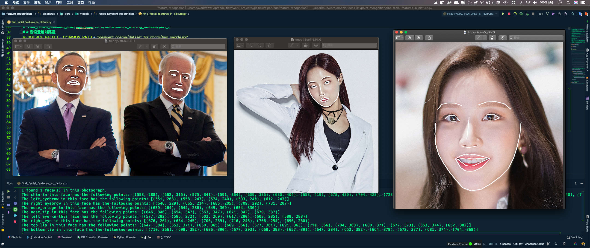
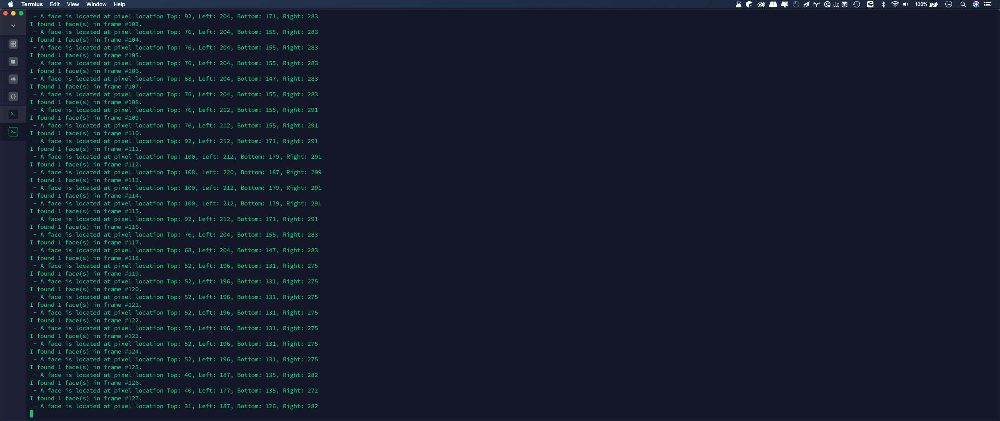
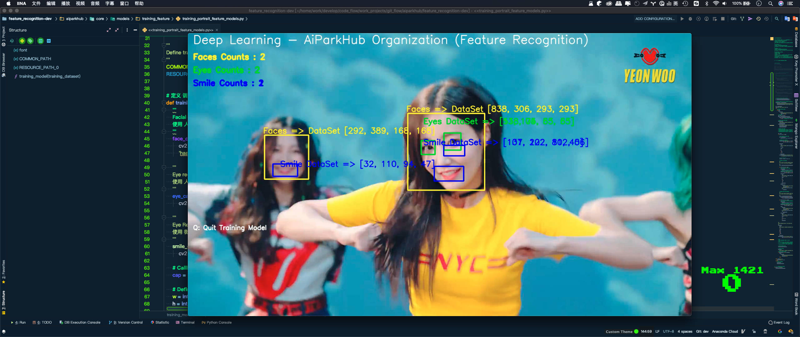

# 🎊 feature_recognition 🎊

<br>

[]()
[](./README_CN.md)
[](./README.md)
[]()
[]()
[]()
[]()
[](https://pypi.python.org/pypi/face_recognition)
[](https://github.com/aiparkhub)
[](https://github.com/aiparkhub)
[](https://github.com/jeep711)

<br>

<div align="center" style="width:1920px;height:500px">


</div><br>

- **AIParkHub-Organization | 踏上AI浪潮 推动机器智能的极限**
- **`Official Public Email`**
- Organization Email：<aiparkhub@outlook.com> —— <geekparkhub@outlook.com> —— <hackerparkhub@outlook.com>
- Developer Email：<jeep711.home.@gmail.com> —— <jeep-711@outlook.com>
- System Email：<systemhub-711@outlook.com>
- Service Email：<servicehub-711@outlook.com>

## 1. 前言
#### 向所有科技领域的贡献者致敬
> 你正在阅读的[feature_recognition](https://github.com/aiparkhub/feature_recognition)是`AiParkHub-Organization`基于`Python`编程语言之上构建的强大人脸识别开源项目, 易上手的简洁人脸识别库配备了应用案例, 为你提供`Python`命令行工具提取、识别、操作人像面部;

> 人脸识别是基于业内领先的C++开源库[dlib](http://dlib.net/)中的深度学习模型, 采集[Labeled Faces in the Wild](http://vis-www.cs.umass.edu/lfw/)人脸数据集进行测试, 准确率高达`99.38%`, 但对儿童和亚洲人像面部的识别准确率尚待提升;

> [Labeled Faces in the Wild](http://vis-www.cs.umass.edu/lfw/) 是美国麻省大学安姆斯特分校(University of Massachusetts Amherst)制作的人像面部数据集, 该数据集包含了从网络收集的`13,000`多张面部图像;

## 2. 项目树形结构
```
.
├── LICENSE
├── README.md
├── README_CN.md
├── aiparkhub
│   ├── __init__.py
│   └── core
│       ├── __init__.py
│       ├── data
│       │   └── feature_training_dataset
│       │       ├── part_0
│       │       │   └── face_recognition_models
│       │       │       ├── dlib_face_recognition_resnet_model_v1.dat
│       │       │       ├── mmod_human_face_detector.dat
│       │       │       ├── shape_predictor_5_face_landmarks.dat
│       │       │       └── shape_predictor_68_face_landmarks.dat
│       │       ├── part_1
│       │       │   ├── momoland
│       │       │   │   ├── dataset_for_photo
│       │       │   │   ├── dataset_for_video
│       │       │   │   └── rendering_data
│       │       │   ├── president_obama
│       │       │   │   ├── dataset_for_photo
│       │       │   │   ├── dataset_for_video
│       │       │   │   └── rendering_data
│       │       │   └── short_video
│       │       ├── part_2
│       │       │   ├── AJ_Cook
│       │       │   ├── ......
│       └── models
│           ├── __init__.py
│           ├── faces_keypoint_recognition
│           │   ├── __init__.py
│           │   ├── digital_makeup.py
│           │   └── find_facial_features_in_picture.py
│           ├── faces_positioning
│           │   ├── __init__.py
│           │   ├── blur_faces_on_webcam.py
│           │   ├── find_faces_in_batches.py
│           │   ├── find_faces_in_picture.py
│           │   └── find_faces_in_picture_cnn.py
│           ├── faces_recognition
│           │   ├── __init__.py
│           │   ├── face_distance.py
│           │   ├── face_recognition_knn.py
│           │   ├── facerec_from_video_file.py
│           │   ├── feature_recognition.py
│           │   ├── feature_recognition_multiprocessing.py
│           │   └── identify_and_draw_boxes_on_faces.py
│           └── training_feature
│               ├── __init__.py
│               └── training_portrait_feature_models.py
├── docs
├── face_recognition
│   ├── __init__.py
│   ├── api.py
│   ├── face_detection_cli.py
│   └── face_recognition_cli.py
├── requirements.txt
├── requirements_dev.txt
├── resource
├── tox.ini
└── trained_knn_model.clf

124 directories, 249 files
```

## 3. 如何使用
### 3.1 克隆工程
``` bash
git clone https://github.com/aiparkhub/feature_recognition.git
```

### 3.2 (Mac或者Linux之上) 安装Python依赖库
> 3.20 ⚠️ 预先检查Python版本 - Python版本应>=3.x.x
> 环境配置

- Python 3.3+ or Python 2.7
- macOS or Linux 
- Windows并不是官方支持的, 但也许也能用
``` bash
(base) systemhub:~ system$ python --version
Python 3.7.5
(base) systemhub:~ system$ 
```

> 3.2.1 ⚠️ 预先检查pip版本
``` bash
(base) systemhub:~ system$ pip --version
pip 20.0.2 from /XXX/XXX/Python.framework/Versions/3.7/lib/python3.7/site-packages/pip (python 3.7)
(base) systemhub:~ system$ pip3 --version
pip 20.0.2 from /XXX/XXX/Python.framework/Versions/3.7/lib/python3.7/site-packages/pip (python 3.7)
(base) systemhub:~ system$ 
```
> 
> 3.2.2 ⚠️ 如pip版本过低. 应升级更新pip版本 (非低版本跳过此步骤, 进行下一步)
>
> 如pip默认为海外镜像源, 网络连接较差,可临时使国内镜像站升级pip, 升级后再将pip默认设置为国内镜像源.
```
pip install -i https://pypi.tuna.tsinghua.edu.cn/simple pip -U
```
> 
> 将pip默认设置为国内镜像源
```
pip config set global.index-url https://pypi.tuna.tsinghua.edu.cn/simple
```

> 3.2.3 基于 生产版本 | 如有多本版pip, 请使用pip3进行操作
``` bash
pip3 install -r requirements.txt
```
> 
> 3.2.4 基于 开发版本 | 如有多本版pip, 请使用pip3进行操作
``` bash
pip3 install -r requirements_dev.txt
```


## 4. 特性工程示例

### 4.1 基于 (工程示例)
> 如果你的机器是多核CPU, 你可以通过并行运算加速人脸识别, 例如, 如果你的机器CPU有四个核心, 那么你可以通过并行运算提升大概四倍的运算速度;
>
> 如果你使用Python3.4或更新的版本, 可以传入 `--cpus <number_of_cpu_cores_to_use>` 参数或者传入`--cpus -1`参数来调用CPU的所有核心;
``` bash
$ python example.py --cpus 4
$ python example.py --cpus -1
```

#### 4.1.1 人像面部关键点识别
- [示例: 为人像面部绘制美妆](aiparkhub/core/models/faces_keypoint_recognition/digital_makeup.py)
> 
``` bash
$ python aiparkhub/core/models/faces_keypoint_recognition/digital_makeup.py --cpus 4
```

- [示例: 提取人像面部关键点](aiparkhub/core/models/faces_keypoint_recognition/find_facial_features_in_picture.py)
> 
``` bash
$ python aiparkhub/core/models/faces_keypoint_recognition/find_facial_features_in_picture.py --cpus 4
```


#### 4.1.2 人像面部定位
- [示例: 定位人像面部](aiparkhub/core/models/faces_positioning/find_faces_in_picture.py)
> 
``` bash
$ python aiparkhub/core/models/faces_positioning/find_faces_in_picture.py --cpus 4
```

- [示例: 基于卷积神经网络深度学习模型 定位人像面部](aiparkhub/core/models/faces_positioning/find_faces_in_picture_cnn.py)
> 
``` bash
$ python aiparkhub/core/models/faces_positioning/find_faces_in_picture_cnn.py --cpus 4
```

- [示例: 基于卷积神经网络深度学习模型 批量识别 资源中的人像面部](aiparkhub/core/models/faces_positioning/find_faces_in_batches.py)
> 
``` bash
$ python aiparkhub/core/models/faces_positioning/find_faces_in_batches.py --cpus 4
```

- [示例: 基于网络摄像头视频 面部高斯模糊 (需安装OpenCV)](aiparkhub/core/models/faces_positioning/blur_faces_on_webcam.py)
> 
``` bash
$ python aiparkhub/core/models/faces_positioning/blur_faces_on_webcam.py --cpus -1
```


#### 4.1.3 人像面部识别
- [示例: 人脸识别之后在原图上绘制标示框并标注姓名](aiparkhub/core/models/faces_recognition/identify_and_draw_boxes_on_faces.py)
> 
``` bash
$ python aiparkhub/core/models/faces_recognition/identify_and_draw_boxes_on_faces.py --cpus 4
```

- [示例: 在不同精度上比较两张面部是否属于一个人](aiparkhub/core/models/faces_recognition/face_distance.py)
> 
``` bash
$ python aiparkhub/core/models/faces_recognition/face_distance.py --cpus 4
```

- [示例: 人脸识别 - 快速训练模型 & 慢速训练模型 (需安装OpenCV)](aiparkhub/core/models/faces_recognition/feature_recognition.py)
> 
``` bash
$ python aiparkhub/core/models/faces_recognition/feature_recognition.py --cpus -1
```

- [示例: 计数统计人像面部特征](aiparkhub/core/models/training_feature/training_portrait_feature_models.py)
> 
``` bash
$ python aiparkhub/core/models/training_feature/training_portrait_feature_models.py --cpus -1
```

- [示例: 基于K最近邻KNN分类算法人脸识别](aiparkhub/core/models/faces_recognition/face_recognition_knn.py)
> 
``` bash
$ python aiparkhub/core/models/faces_recognition/face_recognition_knn.py --cpus 4
```

- [示例: 加速人脸识别运算](aiparkhub/core/models/faces_recognition/feature_recognition_multiprocessing.py)
> 
``` bash
$ python aiparkhub/core/models/faces_recognition/feature_recognition_multiprocessing.py --cpus -1
```


#### 4.1.4 推荐相似内容 技术博客
- [Face recognition with OpenCV, Python, and deep learning](https://www.pyimagesearch.com/2018/06/18/face-recognition-with-opencv-python-and-deep-learning/) by Adrian Rosebrock
  - 主要内容: 如何实际使用;
- [Face clustering with Python](https://www.pyimagesearch.com/2018/07/09/face-clustering-with-python/) by Adrian Rosebrock
  - 主要内容: 使用非监督学习算法实现将图片中的人像面部高斯模糊;


#### 4.1.5 人脸识别 原理
如果你想更深入了解人脸识别这个黑箱的原理 [请点击阅读该技术博客](https://medium.com/@ageitgey/machine-learning-is-fun-part-4-modern-face-recognition-with-deep-learning-c3cffc121d78)


## 5. 警告说明
- 该开源项目是基于`成年人面部`训练出的识别模型, 如果识别模型应用在儿童身上效果可能一般, 如果资源中有多个儿童, 建议将临界值设为`0.6`;


## 6. 相关问题反馈
> 如果出了问题, 请在`Github`-[aiparkhub/feature_recognition](https://github.com/aiparkhub/feature_recognition/issues)仓库进行提交Issue;


## 7. 鸣谢
- 非常感谢 [Davis King](https://github.com/davisking) ([@nulhom](https://twitter.com/nulhom)) 创建了`dlib`库, 提供了响应的人脸关键点检测和人脸编码相关的模型, 你可以查看 [blog post](http://blog.dlib.net/2017/02/high-quality-face-recognition-with-deep.html) 网页获取更多有关ResNet的信息;
- 感谢每一个相关Python模块(包括: `numpy`, `scipy`, `scikit-image`, `pillow`等)的贡献者;
- 感谢 [Cookiecutter](https://github.com/audreyr/cookiecutter) 和 [audreyr/cookiecutter-pypackage](https://github.com/audreyr/cookiecutter-pypackage) 项目模板, 使得Python的打包方式更容易接受;


## 8. 后记
> 该项目仅仅是关于计算机视觉领域的起点, 该项目将持续研发, 后续还有很多技术梦想要实现, 让每一次的版本迭代都成为里程碑上的一颗铆钉;

## 9. 开源协议
 [Apache License Version 2.0](./LICENSE)
 
 ---------
